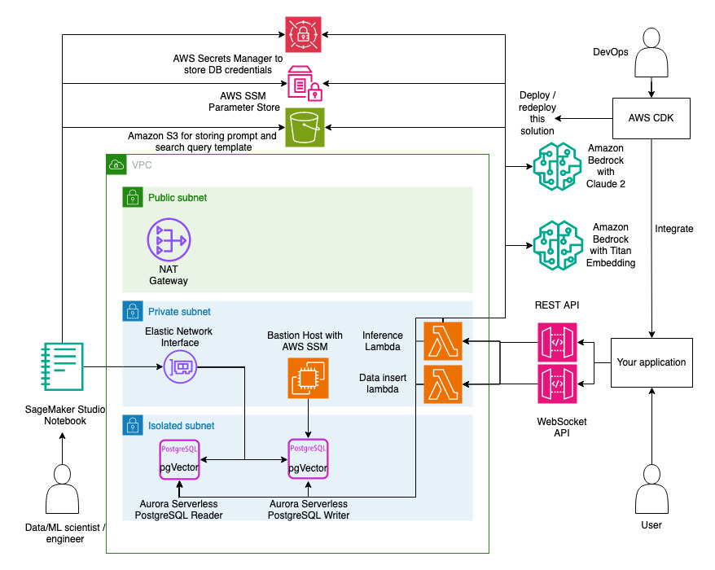

# Content-based Recommender System with LLM

## Introduction

This is a deployable content-based recommender system. It is called "content-based" as it bases the recommendation based on the matching between the input's content and the items' content from your database. This uses prompt to large-language models (LLM) and vector search to perform the recommendation. 

An **input** is a text which represents the query to this recommender system. For example, it may be a traveler bio like the text below.

`Female, 30 years old, married
I really want to celebrate my wedding anniversary with Husband. 
Somewhere where we can have a picnic with our own bento with wide view of sky and city.`

An **item** is a text which is typically stored in a database which represents "what to be recommended". There can be many items in the database. For example, it may be the description of a plce to travel like below.

`Marina Barrage
Country: Singapore
This is actually a dam built on the mouth of Marina Channel to supply fresh water to Singapore. It also functions as a flood control and as an attraction point for families.\nIt's roof has grass with path for people to walk up from ground. Families can fly kites on that roof or just simply have a wide view of the Singapore city's buildings.\nIt is also situated in the midst of cycling path that connects the East Coast Park cycling path and the city cycling path.`

This recommender system can take the input, ask LLM to generate several ideal **item types**, convert those to embeddings, perform vector search to find most relevant real items in your database, and return the recommended items.

This solution provides you with the vector database, access to LLMs, the recommendation workflow, and the APIs for getting recommendation and for loading new items into the database. You can integrate your application to use this solution by calling the APIs. This solution is also customizable where you can load the database with your own data, add columns, change DB queries, and change the prompt template for the LLM. Those can be done via provided Jupyter notebooks without having to modify the CDK infrastructure code. Please find the architecture below. Note that the diagram uses simplified networking, while the actual solution uses 3 subnets for each type, spanning across 3 Availability Zones.

## Deployment

### Prerequisites

Here are prerequisites for deploying this solution with AWS CDK:

1. AWS account with Amazon Bedrock model access enabled for Claude and Titan Embeddings G1 - Text. Follow the steps in https://docs.aws.amazon.com/bedrock/latest/userguide/model-access.html#add-model-access to enable those models and make sure the region is correct.
2. Make 3.82 or above in your environment
3. AWS IAM credentials with sufficient permission for deploying this solution configured in your environment. See https://docs.aws.amazon.com/cli/latest/userguide/cli-configure-files.html for credentials setup.
4. AWS CLI 2.15.5 or above / 1.29.80 or above. Follow https://docs.aws.amazon.com/cli/latest/userguide/getting-started-install.html for installation.
5. Python 3.8 or above, pip, and virtualenv.
6. Docker 20.10.25 or above
7. NodeJS 16 with version 16.20.2 above, or NodeJS 20 with version 20.10.0 or above, along with NPM.
8. jq, zip, unzip
9. CDK Toolkit 2.122.0 or above. Follow https://docs.aws.amazon.com/cdk/v2/guide/getting_started.html#getting_started_install for installation.
10. Python CDK lib 2.122.0  or above. Follow https://docs.aws.amazon.com/cdk/v2/guide/getting_started.html#getting_started_concepts. 
11. CDK nag 2.28.16 or above.

To automatically install item 4-11 of those prerequisites run. `make prepare`

The `make prepare` utility is currently supported only for MacOS Ventura, Amazon Linux 2, and Amazon Linux 2023 operating systems.

### Deploy

**IMPORTANT**

At the moment,this solution can only be used in AWS regions where Amazon Bedrock is available.
At the time of the writing of this document, you can deploy and use this in us-east-1 (N. Virginia) and us-west-2 (Oregon) regions.

Follow the steps below for deploying this solution from your current environment

1. Make sure that all prerequisites are met. Please refer to the [Prerequisites](#prerequisites) section above.

2. Run `make bootstrap_and_deploy` and enter some configuration inputs when prompted.

3. [Optional] For second or later redeployment, run `make deploy` instead.

You can choose whether or not to deploy bastion host. If you use SageMaker Studio (part of this solution) to load data and perform iterations on the configuration and prompt engineering, then bastion host may not be needed since the SageMaker Studio has access to the VPC subnet which hosts the database.

See [this section](#what-are-provided-by-this-solution?) for the list of components to be deployed.

## Use

After a successful deployment, you need to configure the solution first.

You must configure the prompt template to suite your use case. You may also need to configure the database and parameters. Please follow these steps.

1. Log in to your AWS Console.
2. Use SageMaker Studio deployed by the [Deploy](#deploy) section. Follow this instruction to open the SageMaker Studio https://docs.aws.amazon.com/sagemaker/latest/dg/studio-updated-launch.html#studio-updated-launch-console. Use the domain name and user profile name "setup-user" already deployed by this solution.
3. Once Studio opens, click "JupyterLab" icon on the left. It should show the already run JupyterLab app for you.
4. Click "Open" on the only running JupyterLab instance.
5. Follow the notebooks from 01 to 04.
    * Notebook 01 helps you do to step by step data loading when you want to use your own data. You can upload your dataset file into the SageMaker Studio. The notebook will help to configure the Aurora Serverless PostgreSQL with pgVector extension, create the table, and insert your data into the database. The SageMaker Studio is deployed with configuration that allows VPC access to the deployed database.
    * Notebook 02 helps you do engineer the prompt for the LLM, to engineer the vector search query statement, and to tweak the default LLM parameters and the recommendation related parameters such as the number of items to be recommended. This notebook is intended to be used iteratively until you are satisfied with all the configuration. Since this is customizable, you can even change your prompt one/few shots and implement filtering when searching the recommended item from the vector database e.g. WHERE clause.
    * Notebook 03 deploys the configuration you set up in notebook 02 into the solution. It involves deploying the prompt template and search query template into S3 and updating the default LLM parameters and recommendation related parameters to AWS SSM Parameter Store.
    * Notebook 04 does the testing of the API call for both the REST API and WebSocket. It covers both the inference API and the data loading API. This can be used as sample on how your application code can use this solution via API to be used in the actual application.

## Destroy

To remove the solution from your AWS account follow these steps:

1. Disable the RDS deletion protection as appropriate. You need to modify the RDS Aurora PostgreSQL cluster created by this solution by following [these steps](https://docs.aws.amazon.com/AmazonRDS/latest/AuroraUserGuide/Aurora.Modifying.html#Aurora.Modifying.Cluster) and make sure you **uncheck** the "Enable deletion protection". You can choose to "Apply immediately" as appropriate.
2. Find the S3 bucket provisioned by this stack and empty the bucket. The bucket name should start with "recommenderstack". Follow this [documentation](https://docs.aws.amazon.com/AmazonS3/latest/userguide/empty-bucket.html) to empty a bucket.
3. Run `make destroy`

## Security

See [CONTRIBUTING](CONTRIBUTING.md#security-issue-notifications) for more information.

## License

This library is licensed under the MIT-0 License. See the LICENSE file.

## FAQs
### When to use this content-based recommender system and when not to use it?

A recommender system returns recommended items given an input. It can be based on collaborative filtering, content, or even continuous feedback with reinforcement learning. [Amazon Perssonalize](https://aws.amazon.com/personalize/) can be used as a recommender system which can use the historical user-item interactions as well as the user and item metadata. We need to have a minimum number of interactions between users and items to use Personalize.

There are situations where historical user-items interactions do not exist. For example, a company does a B2B business by recommending clients to find the right data labeller worker from among hundreds of workers in the list. The client will come with a specific requirement and description of the data labelling task. We can use content-based recommendation to find the most suitable data labeler worker for the task by matching the task description and the labeler bio. Generally, this approach may be suitable in these scenarios:
1. Past interactions data with items do not exist or is insufficient.
2. Instead of doing user-item matching, you need to do requirement-item matching. A user can have multiple requirements along time, where each can be completely unrelated to one another. For example, last year the client requested for a data labeler for medical image segmentation and now they request for a labeler for text sentiment analysis in Bahasa Indonesia.
3. Recommending a pairing between one item with another item of completely different nature e.g. a job description and a set of courses to help getting the job, especially when you have no internal database which pairings of jobs and courses already.

For B2C e-commerce applications where users interact often and recommendation pattern can be established, you can potentially other recommender systems which also take into account the historical interactions.

### What is the rationale of usin LLM & vector search and how does this solution actually work?
With generative artificial intelligence, we can now create an LLM-powered content-based recommender. We can put our available items in the prompt's context and ask the LLM to recommend items given an input. However, there is typically a limit on how many items we can add in the prompt context due to the context window limit. As one solution, you can vectorize your items with text-to-embedding model, store them in a vector database, and use embedding search to find the relevant item. Of course we need to produce the reference item embedding during the search. This is to be provided by the combination of text-to-text-to-text LLM which is expected to produce a recommended **item type** given an **input** and the text-to-embedding LLM to convert the recommended item type into a reference embedding for search.

This deployable solution can be used for content-based item recommendation by leveraging GenAI. This solution leverages a vector database on Aurora Serverless v2 PostgreSQL database with pgVector extension. It also uses Amazon Bedrock with Amazon Titan Embedding and Anthropic Claude 2 models. Generally the process is shown below. Let's take an example of travel recommendation system.
1. Somebody comes to travel agent. The person rarely travels. The person gives a travel bio on what he/she may like. Let's call this an **input**.
2. This solution will ask Claude 2 on Bedrock that given this profile, what place types would be ideal to visit during travel. Let's call this the recommended **item types**. One/few shots technique can be used to influence how the LLM should format the recommended item types, ideally with the similar format as the stored places data.
3. Each recommended item type is converted into embedding with Titan Embedding model.
4. A search is performed on the vector database to find the recommended **items**, which are the closest to the recommended item types.

### What are provided by this solution?
This solutions provides REST and WebSocket APIs (using Amazon API Gateway) for data loading and for inference which your application can integrate with. It also provides a set of Jupyter notebooks to do data loading, to tweak the prompt if necessary, and to test the inference. 

These components are to be deployed:
1. VPC with isolated subnets to host the database, private subnets for the SageMaker Studio, bastion host, and main Lambda functions, and public subnets for the NAT Gateway.
2. Aurora Serverless PostgreSQL with writer and reader endpoints, each with 0.5 ACU as minimum capacity. The database name is "vectordb"
3. pgVector extension in the Aurora Serverless PostgreSQL and a simple "items" table with columnds: id, description (text), and embedding (vector)
4. (Optional) Bastion host to access the database, accessible using AWS SSM Session Manager
5. Lambda function, API, and WebSocket API for getting recommended items
6. Lambda function, API, and WebSocket API for inserting data into vector database
7. SageMaker Studio with Jupyter lab environment for configuring and customizing the solution with data loading, prompt engineering, and configuration changes.
8. AWS Secrets Manager to store database secrets
9. AWS SSM Parameter Store to store the LLM parameters and recommendation related parameters
10. Amazon S3 bucket to store prompt and query template

Amazon Bedrock will be used as well.

